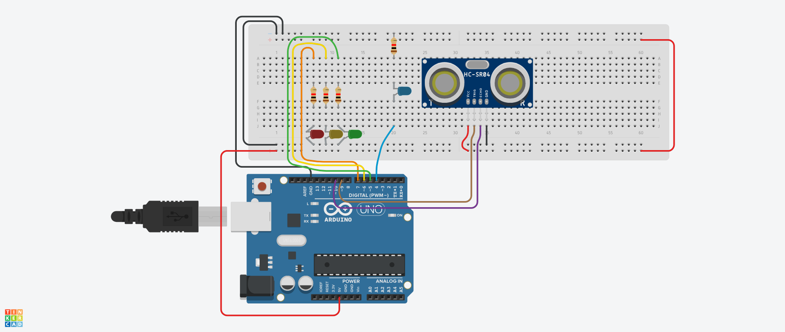

  
  <h1>🚦 Akıllı Trafik Lambası (Smart Traffic Light)</h1>

Bu proje, trafik ışıklarında gereksiz beklemeleri önlemek amacıyla geliştirilmiş, sensör tabanlı bir otonom trafik lambası prototipidir. **Kayseri Üniversitesi** ve **BTK Akademi** çalışmaları kapsamında **Hüseyin YILMAZ** ve **Emre Alıcı** tarafından geliştirilmiştir.

## 📌 Proje Hakkında

Günlük hayatta araçların boş yollarda kırmızı ışıkta gereksiz yere beklemesini önlemek amacıyla tasarlanmıştır. Sistem, ultrasonik mesafe sensörü kullanarak belirli bir mesafede (20 cm) araç (engel) algıladığında trafik akışını otomatik olarak yönetir.

### ⚙️ Çalışma Prensibi
Sistem `Arduino Uno` mikrodenetleyicisi üzerinde çalışır:
1.  **Bekleme Modu:** Engel yokken Kırmızı Işık yanar, Sensör durum LED'i aktiftir.
2.  **Algılama:** Sensör 20 cm mesafede bir araç algıladığında sistem tetiklenir.
3.  **Geçiş:** Sırasıyla Kırmızı -> Sarı -> Yeşil ışık döngüsü çalışır.
4.  **Geçiş Süresi:** Araç sensör önünden çekildikten sonra 5 saniye daha Yeşil ışık yanmaya devam eder, ardından tekrar Sarı -> Kırmızı döngüsüne girer.

## 🛠 Kullanılan Malzemeler

| Malzeme | Adet | Açıklama |
| :--- | :---: | :--- |
| Arduino Uno | 1 | Mikrodenetleyici |
| HC-SR04 | 1 | Ultrasonik Mesafe Sensörü |
| LED (Kırmızı, Sarı, Yeşil) | 3 | Trafik ışıkları için |
| LED (Mavi/Diğer) | 1 | Sensör durumu için |
| Direnç (220Ω veya 330Ω) | 4 | LED koruması için |
| Jumper Kablolar | - | Bağlantılar için |
| Breadboard | 1 | Devre kurulumu için |

## 🔌 Devre Şeması ve Pin Bağlantıları

Proje devresi aşağıdaki pin konfigürasyonuna göre kurulmuştur:

* **TRIG_PIN:** 9
* **ECHO_PIN:** 10
* **SENSOR_LED:** 7
* **KIRMIZI_LED:** 6
* **SARI_LED:** 5
* **YEŞİL_LED:** 4

## 🚀 Kurulum ve Kullanım

1.  Bu repoyu klonlayın veya `.ino` dosyasını indirin.
2.  Devreyi şemaya uygun şekilde kurun.
3.  Arduino IDE ile kodu kartınıza yükleyin.
4.  Sensörün önüne elinizi veya bir cismi koyarak trafik lambası döngüsünü test edin.

## 👥 Yazarlar

* **Hüseyin YILMAZ** - [GitHub Profilim](https://github.com/huseyin-yilmaz-astro)
* **Emre Alıcı** - [GitHub Profilim](https://github.com/EmreAliciTr)

---
*Bu proje açık kaynaklıdır ve eğitim amaçlı geliştirilmiştir.*
